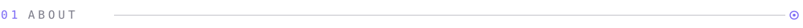
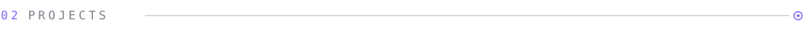
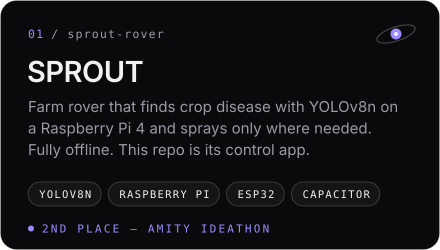
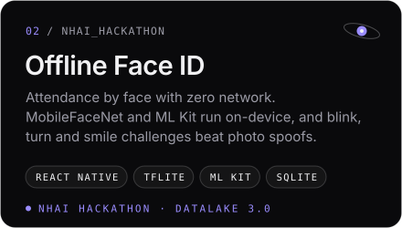
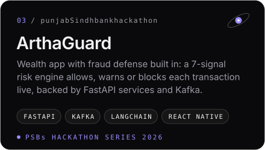
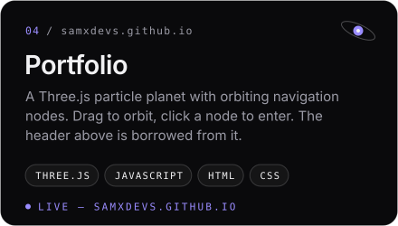
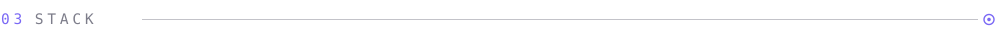
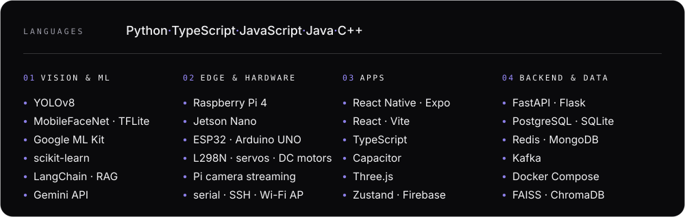
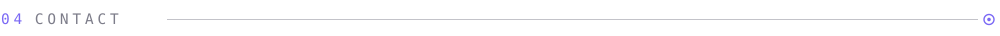

<!-- samxdevs // github profile · design matches samxdevs.github.io -->
<a href="https://samxdevs.github.io"><picture><source media="(prefers-color-scheme: dark)" srcset="assets/header-dark.svg"><source media="(prefers-color-scheme: light)" srcset="assets/header-light.svg"></picture></a>

I'm **Sam**, a B.Tech AI student at Amity University, Noida (batch of 2028). I like AI that leaves the notebook: models that run on a Raspberry Pi in a crop field, on a phone with no signal, on hardware I wired up myself. Most of what's below started at a hackathon.

- **Now** — computer vision that runs offline, on-device, in the field
- **Won** — 2nd place at Amity Ideathon with SPROUT
- **Make** — Hinglish reels about AI tools and dev stuff on [Instagram](https://www.instagram.com/samxdevs/)
- **Ask me about** — YOLO on a Raspberry Pi, face recognition without internet, RAG pipelines

<a href="https://github.com/samxdevs/sprout-rover"><picture><source media="(prefers-color-scheme: dark)" srcset="assets/card-sprout-dark.svg"><source media="(prefers-color-scheme: light)" srcset="assets/card-sprout-light.svg"></picture></a>
<a href="https://github.com/samxdevs/NHAI_HACKATHON"><picture><source media="(prefers-color-scheme: dark)" srcset="assets/card-faceid-dark.svg"><source media="(prefers-color-scheme: light)" srcset="assets/card-faceid-light.svg"></picture></a>

<a href="https://github.com/samxdevs/punjabSindhbankhackathon"><picture><source media="(prefers-color-scheme: dark)" srcset="assets/card-arthaguard-dark.svg"><source media="(prefers-color-scheme: light)" srcset="assets/card-arthaguard-light.svg"></picture></a>
<a href="https://samxdevs.github.io"><picture><source media="(prefers-color-scheme: dark)" srcset="assets/card-portfolio-dark.svg"><source media="(prefers-color-scheme: light)" srcset="assets/card-portfolio-light.svg"></picture></a>

<picture><source media="(prefers-color-scheme: dark)" srcset="assets/stack-dark.svg"><source media="(prefers-color-scheme: light)" srcset="assets/stack-light.svg"></picture>

<a href="https://samxdevs.github.io"><picture><source media="(prefers-color-scheme: dark)" srcset="assets/link-portfolio-dark.svg"><source media="(prefers-color-scheme: light)" srcset="assets/link-portfolio-light.svg"></picture></a>
<a href="https://www.instagram.com/samxdevs/"><picture><source media="(prefers-color-scheme: dark)" srcset="assets/link-instagram-dark.svg"><source media="(prefers-color-scheme: light)" srcset="assets/link-instagram-light.svg"></picture></a>
<a href="https://x.com/saimldx"><picture><source media="(prefers-color-scheme: dark)" srcset="assets/link-x-dark.svg"><source media="(prefers-color-scheme: light)" srcset="assets/link-x-light.svg"></picture></a>
<a href="https://leetcode.com/u/samxdevs/"><picture><source media="(prefers-color-scheme: dark)" srcset="assets/link-leetcode-dark.svg"><source media="(prefers-color-scheme: light)" srcset="assets/link-leetcode-light.svg"></picture></a>
<a href="mailto:samxdevs@gmail.com"><picture><source media="(prefers-color-scheme: dark)" srcset="assets/link-email-dark.svg"><source media="(prefers-color-scheme: light)" srcset="assets/link-email-light.svg"></picture></a>

 

<picture><source media="(prefers-color-scheme: dark)" srcset="https://raw.githubusercontent.com/samxdevs/samxdevs/output/snake-dark.svg"><source media="(prefers-color-scheme: light)" srcset="https://raw.githubusercontent.com/samxdevs/samxdevs/output/snake-light.svg"></picture>
